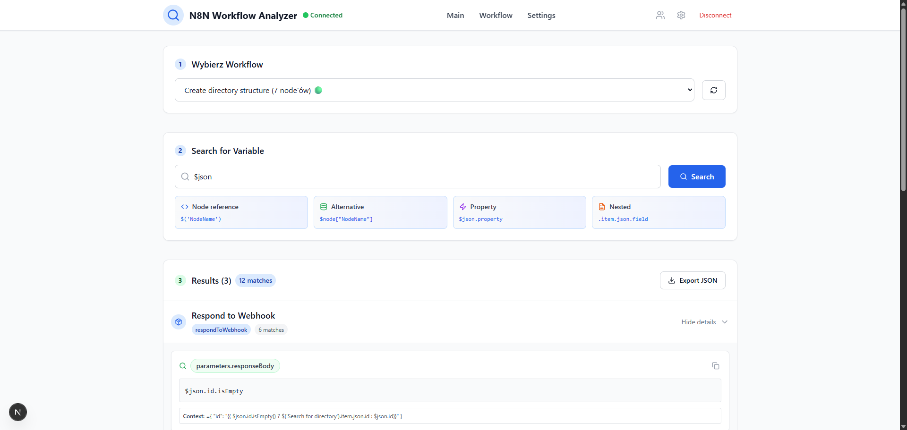

# N8N Variable Finder

A modern web app for searching and analyzing variable usage in your [n8n](https://n8n.io) workflows. Securely manage multiple n8n API sessions, search for variables, and quickly find where and how they are used in your automations.



## Features
- 🔒 **Secure session management** (encrypted API keys & URLs)
- 🔍 **Variable search** across all nodes in a workflow
- 🧑‍💻 **Multiple n8n environments** (sessions)
- 🟢 **Online/offline status** in the navbar
- 🧩 **Modern UI** (Next.js, TailwindCSS, React 19)
- 🧪 **Comprehensive tests** (Jest, React Testing Library)

## Getting Started

### 1. Install dependencies
```bash
npm install
```

### 2. Run in development
```bash
npm run dev
```
Visit [http://localhost:3000](http://localhost:3000)

### 3. Run tests
```bash
npm test
```

### 4. Build for production
```bash
npm run build
npm start
```

## Configuration
- No .env required by default. All session data is stored in browser storage (localStorage/sessionStorage).
- To use with your n8n instance, add a session in the app with your n8n API URL and API key.

## Technologies Used
- [Next.js](https://nextjs.org/) 15
- [React](https://react.dev/) 19
- [Tailwind CSS](https://tailwindcss.com/)
- [Jest](https://jestjs.io/) & [React Testing Library](https://testing-library.com/)
- [CryptoJS](https://www.npmjs.com/package/crypto-js) (encryption)

## Project Structure
- `src/app/` — Next.js app routes & API endpoints
- `src/components/` — React UI components
- `src/contexts/` — React context for session management
- `src/lib/` — Utility functions (encryption, etc.)
- `__tests__/` — All tests

## Contributing
Pull requests are welcome! For major changes, please open an issue first to discuss what you would like to change.

## License
MIT

---

> Favicon/logo: see `public/next.svg` (replace with your own for production)
